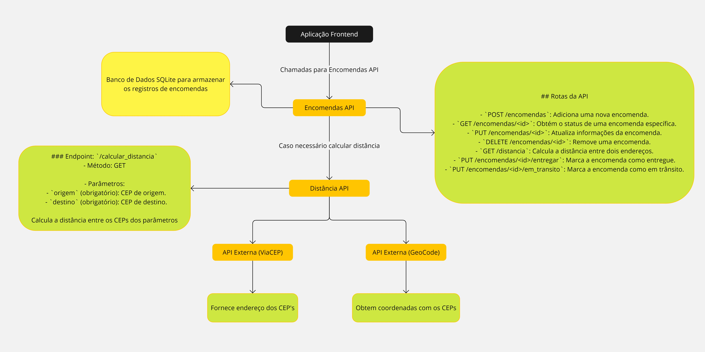

# Encomendas API

Esta é uma API para gerenciar encomendas. Ela permite adicionar, consultar, atualizar, deletar e marcar encomendas como entregues ou em trânsito, além de calcular a distância entre dois endereços.

## Requisitos

- Python 3.x
- Flask
- Flask-RESTx
- SQLAlchemy
- requests
- Um servidor backend rodando a `distancia_api` na porta `5001`.

## Estrutura do Projeto

- `app.py`: Arquivo principal contendo a definição da API.
- `model/encomenda_model.py`: Definição do modelo Encomenda e configuração do banco de dados.
- `schemas/encomenda_schema.py`: Esquema para serialização/deserialização do modelo Encomenda.
- `logger.py`: Configuração de logging.
- `requirements.txt`: Lista de dependências do projeto.
- `README.md`: Documentação do projeto.

##  Como Usar - Usando Docker

### Construção da Imagem
 
 Clone o repositório:
   ```sh
   git clone https://github.com/vitaledu/MVP_API_GestaoEncomendas.git
   cd MVP_API_GestaoEncomendas 
   ```
   
Para construir a imagem Docker, execute o seguinte comando na raiz do projeto:

`docker build -t encomendas_api .` 

### Executar o Contêiner

Para executar o contêiner Docker e conectá-lo à mesma rede que o `distancia_api`, execute o seguinte comando:

`docker run -d --name encomendas_api --network minha_rede -p 5000:5000 encomendas_api` 

## Como Usar - Localmente

1. Clone o repositório:

   ```sh
   git clone https://github.com/vitaledu/MVP_API_GestaoEncomendas.git
   cd MVP_API_GestaoEncomendas 
   ```
   
2.  Crie e ative um ambiente virtual:
    
    ```sh
	   python -m venv venv
    source venv/bin/activate  # No Windows use `venv\Scripts\activate
	  ``` 
    
3.  Instale as dependências:
    
    `pip install -r requirements.txt` 
    
4.  Certifique-se de que a `distancia_api` está rodando na porta `5001`.
    
5.  Execute a aplicação:
    
    `python app.py` 
    

## Endpoints

### Adicionar Encomenda

-   **POST /encomendas**
-   **Descrição:** Adiciona uma nova encomenda.
-   **Request Body:**
    
    `{
      "codigo_rastreamento": "string",
      "descricao": "string",
      "endereco_origem": "string",
      "endereco_destino": "string",
      "status": "string"
    }` 
    

### Consultar Encomenda

-   **GET /encomendas/{id}**
-   **Descrição:** Retorna os detalhes de uma encomenda pelo seu ID.

### Atualizar Encomenda

-   **PUT /encomendas/{id}**
-   **Descrição:** Atualiza os dados de uma encomenda pelo seu ID.
-   **Request Body:** Igual ao de Adicionar Encomenda.

### Deletar Encomenda

-   **DELETE /encomendas/{id}**
-   **Descrição:** Deleta uma encomenda pelo seu ID.

### Marcar Encomenda como Entregue

-   **PUT /encomendas/{id}/entregar**
-   **Descrição:** Marca uma encomenda como entregue pelo seu ID.

### Marcar Encomenda como Em Trânsito

-   **PUT /encomendas/{id}/em_transito**
-   **Descrição:** Marca uma encomenda como em trânsito pelo seu ID.

### Calcular Distância

-   **GET /distancia**
-   **Descrição:** Calcula a distância entre dois endereços.
-   **Parâmetros de Query:** `origem` e `destino`

## Tecnologias Usadas

-   Python
-   Flask
-   Flask-RESTx
-   SQLAlchemy
-   requests

## Repositórios Relacionados

Este projeto faz parte de um conjunto de três repositórios que se complementam, mas cada um pode ser utilizado separadamente em outros projetos, caso necessário.

-   **API para Calcular Distância entre CEPs**
    -   GitHub: [MVP_API_CalcularDistanciaCEP](https://github.com/vitaledu/MVP_API_CalcularDistanciaCEP)
-   **API para Gestão de Encomendas (este repositório)**
    -   GitHub: [MVP_API_GestaoEncomendas](https://github.com/vitaledu/MVP_API_GestaoEncomendas)
-   **Frontend para Gestão de Encomendas**
    -   GitHub: [MVP_frontend_GestaoEncomendas](https://github.com/vitaledu/MVP_frontend_GestaoEncomendas)

-   **Miro com a Arquitetura da Aplicação** 
	- [**Link de Acesso**](https://miro.com/app/board/uXjVKzv-qXg=/)

## Diagrama da Aplicação


## Contato

Para mais informações, entre em contato com [eduardolimavital@gmail.com].